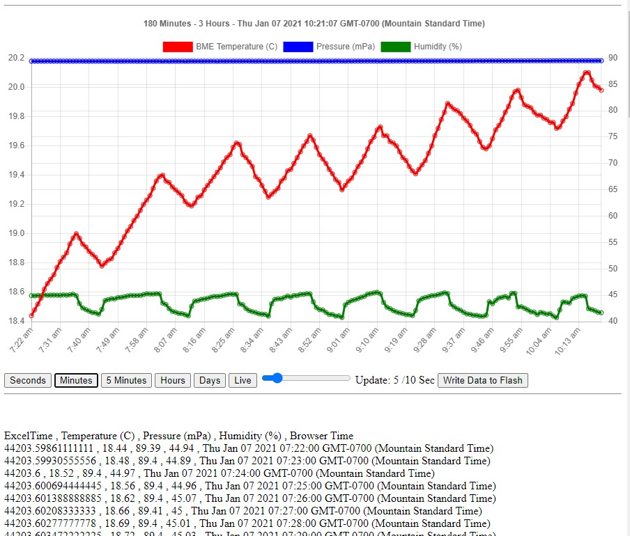
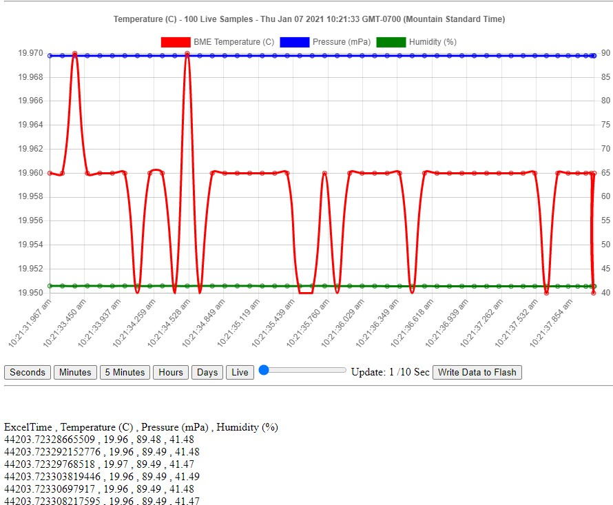
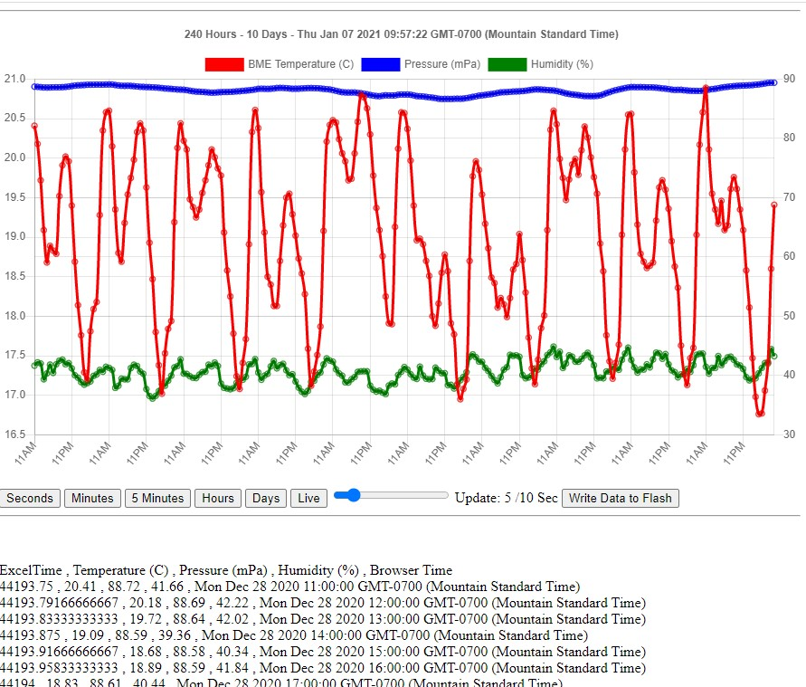
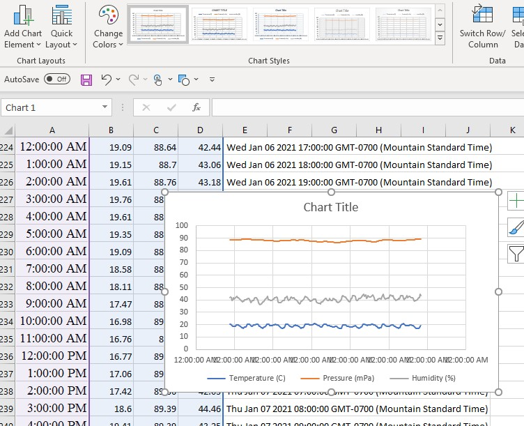

# Simple_8266_Data_Logger
SImple 8266 Data Logger with internal database serving graphs and data to your browser

Here is a very simple data logger project for a WeMos d1 mini 8266 processor and BME 280 temperature/pressure/humidity sensor.
This sort of project could use a local Raspberry Pi database or a Cloud IOT database somewhere in the world, but this version just stores the data in the memory of the 8266, and occasionally writes it to the flash on the 8266 in case of power faiilure or unplugging the device.

As currently set up it an take live snapshots of the sensor at a selectable speed down to 1/10 seconds, plus regular snapshorts:
- live samples 1/10 second to 2 seconds
- 180 1-seconds samples (3 minutes)
- 180 1-minutes samples (3 hours)
- 288 5-minute samples (24 hours)
- 240 1-hour avaerages (10 days)
- 180 1-day averages (6 months)

