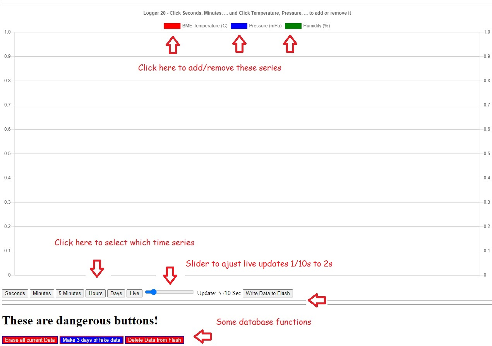

# Simple_8266_Data_Logger
SImple 8266 Data Logger with internal database serving graphs and data to your browser

Here is a very simple data logger project for a WeMos d1 mini 8266 processor and BME 280 temperature/pressure/humidity sensor.
This sort of project could use a local Raspberry Pi database or a Cloud IOT database somewhere in the world, but this version just stores the data in the memory of the 8266, and occasionally writes it to the flash on the 8266 in case of power faiilure or unplugging the device.  None of the dats leaves your house, and you do not need to sign up with a free/paid IOT database and then try to get your data back in a nice format ... or worry about internet traffic, etc.

As currently set up it an take live snapshots of the sensor at a selectable speed down to 1/10 seconds, plus regular snapshorts:
- live samples 1/10 second to 2 seconds
- 180 1-seconds samples (3 minutes)
- 180 1-minutes samples (3 hours)
- 288 5-minute samples (24 hours)
- 240 1-hour avaerages (10 days)
- 180 1-day averages (6 months)

And all the data is presented in a graph on your web browser, plus the data is printed in the browser in a format that you can cut-and-paste into Excel for any fancy formatting or analysis.

Here is an example of the minute data with the text version at the bottom.  The date/time is converted into Excel format for easy formatting in Excel.

Sample of 1/10 seconds live data - the graph starts empty and grows to 100 samples, then it starts rolling the last 100 samples.

Here is an example of the hours screen, plus the same data copied off the webpage and pasted into Excel, and then built into an Excel grapph.

The BME280 connected to the i2c pins at D1 and D2 (gpio5 scl and gpio4 sda).  You can swap sensors or add another sensor with a few lines of code.  
The DS18b20 is not ideal because it takes almost a second to read, and I was going to 1/10 second updates, but if you are interested in seconds, minutes, and days, then it works fine.

Based on this demo from Acrobatic: 
https://acrobotic.com/ 
https://github.com/acrobotic/Ai_Demos_ESP8266/tree/master/bmp180_gui
