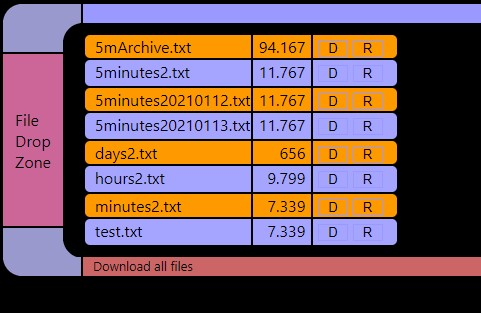

# Simple_8266_Data_Logger
Simple 8266 Data Logger with internal database serving graphs and data to your browser

Here is a very simple data logger project for a WeMos d1 mini 8266 processor and BME 280 temperature/pressure/humidity sensor.
This sort of project could use a local SD card, or a Raspberry Pi database or a Cloud IOT database somewhere in the world, but this version just stores the data in the memory of the 8266, and occasionally writes it to the flash on the 8266 in case of power faiilure or unplugging the device.  None of the data leaves your house, and you do not need to sign up with a free/paid IOT database and then try to get your data back in a nice format ... or worry about internet traffic, security, etc.

As currently set up it an take live snapshots of the sensor at a selectable speed down to 1/10 seconds, plus regular snapshorts:
- 100 live samples 1/10 second to 3 seconds
- 180 1-second samples (3 minutes)
- 180 1-minute samples (3 hours)
- 288 5-minute samples (24 hours)
- 240 1-hour avaerages (10 days)
- 180 1-day averages (6 months)

And all the data is presented in a graph on your web browser, plus the data is printed in the browser in a format that you can cut-and-paste into Excel for any fancy formatting or analysis.

It uses WiFiManager to set the wifi name and password, so unless you are changing the sensor, or the data retention intervals, you can just download it as is.  https://github.com/tzapu/WiFiManager

Update Jan 21, 2021 -- Added an archive to save the 5 Minute samples, and a file manager to download the archive to your pc.  The file manager also allows you to move the data to another 8266, or change the flash size of the 8266 and reload some old data.  The file manager comes from https://github.com/holgerlembke/ESPxWebFlMgr and is included here for simplicity as I cannot find it in the normal Arduino Manage Libraries yet.  You need the entire v27 folder.

The file manager screen.  The 5mArchive.txt file will conatin the 5 minute snapshots and is extended everyday from the 24 hours of 5 minute snapshots file.  The 2 MB LittleFS that on the WeMos d1 Mini will give you about 6 months of 5 Minute data before it runs out of space.  The file is a simple text file with the times in GMT Unixtime format.  Use this equation to convert unixtime to exceltime in a spreadsheet =25569 + E2/ 86400, where E2 has the unixtime.  The graph function only allows you to see the last 24 hours of 5 minute snapshots.

Here is an example of the minute data with the text version at the bottom.  The date/time is converted into Excel format for easy formatting in Excel.

Sample of 1/10 seconds live data - the graph starts empty and grows to 100 samples, then it starts rolling the last 100 samples.

Here is an example of the hours screen, plus the same data copied off the webpage and pasted into Excel, and then built into an Excel grapph.

The BME280 connected to the i2c pins at D1 and D2 (gpio5 scl and gpio4 sda).  You can swap sensors or add another sensor with a few lines of code.  
The DS18b20 is not ideal because it takes almost a second to read, and I was going to 1/10 second updates, but if you are interested in seconds, minutes, and days, then it works fine.

Based on this demo from Acrobatic: 
https://acrobotic.com/ 
https://github.com/acrobotic/Ai_Demos_ESP8266/tree/master/bmp180_gui
